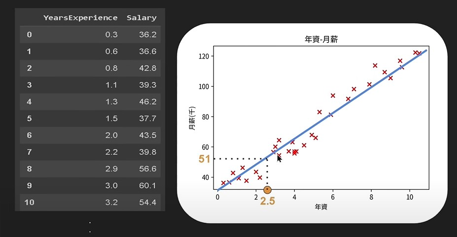
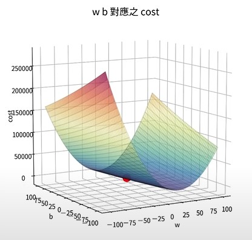
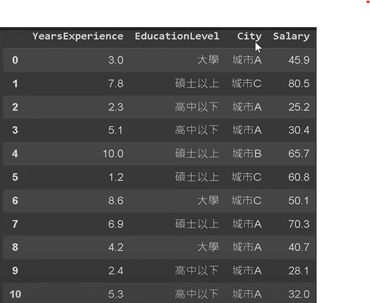

# ML學習筆記
---
## 一、甚麼是機器學習?
一句話來說，機器學習就是「讓機器具備一個找**函式(Function)** 的能力」。
### Different types of functions
1. **Regression(回歸)** : the function outputs a scalar
2. **Classification(分類)** : Given option(classes),the function outputs the correct one.
3. **Structured Learning** : create sth with structure(image,document)
### How to find a function ?機器學習的過程

1. Function with Unkown Parameters(寫出帶有未知參數的函式)
>- 首先，根據想解決的問題蒐集資料集。
>- 依照對問題本質上的了解(based on domain knowledge)、資料的分佈等以決定函式的樣貌
>- **Model模型 = 帶有未知參數的函式**
>- 專有名詞: Feature、Weight、bias
2. Define Loss from Traning Data
>- Loss 是以 Unkown Parameters作為輸入的函式。
>- 用途: 為了找出最適合的Unkown Parameters，定義出Loss Function來協助判斷。
>- maen absolute error (MAE) : L = 1/N*&Sigma;e, e = | y - y_pred |
>- maen square error (MSE) : L = 1/N*&Sigma;e, e =  (y - y_pred) &sup2;

3. Optimization 
>- 目的:為避免窮舉出所有的Unkown Parameters，並計算其Loss Function，我們需要設定一個Optimizer(優化器)
>- 梯度下降 Gradient Descent

## 二、Regression實作
以下將介紹與實作"Simple Linear Regression"與"Multiple Linear Regression"
### 簡單線性回歸 Simple Linear Regression
Simple Linear Regression用於探索兩個變量之間的關係。假設兩個變量之間存在線性關係，其中一個變量是自變量（independent variable），另一個變量是因變量（dependent variable）。也就是將資料用一條最適合的「直線」做表示。

以下為一個範例，若今日你是一位公司的老闆，想依照年資給予員工相對應的薪水，決定蒐集市場上的資料做參考。由於年資與薪水呈現正比之關係，故可將資料用一條「直線」作表示。


#### 步驟1. Function with Unkown Parameters
此範例中，令 y = w*x + b 為函式，其中 x 為年資、y 為月薪，而 w、b 為 Unkown Parameters。
```python
#讀取資料集
import pandas as pd

url = "https://raw.githubusercontent.com/GrandmaCan/ML/main/Resgression/Salary_Data.csv"
data = pd.read_csv(url)
# 以 y = w*x + b 表示直線
x = data["YearsExperience"]
y = data["Salary"]
```
#### 步驟2. Define Loss from Traning Data
為了定義出「最適合資料的直線」，也就是找出最適合的 Unkown Parameters ，我們定義出 **成本函數 Cost Function = (真實數據 - 預測值)&sup2;** ，最適合的 w、b 所產生的直線，與所有真實資料的距離平方加總將會是最小值，故在 Cost Function 中，Cost為最小值時，所對應的 w、b 即為最佳的 Unkown Parameters，如下圖所示。

```python
#計算 Cost Function
def compute_cost(x, y, w, b):
  y_pred = w*x + b
  cost = (y - y_pred)**2
  cost = cost.sum() / len(x)

  return cost
```
#### 步驟3. Optimization

#### 梯度下降 Gradient Descent
#### 學習率 Learning rate
### 多元線性回歸 Multiple Linear Regression
同一範例，若想以線性模型來

## 參考資料
1. Hung-yi Lee【機器學習2021】 https://youtu.be/Ye018rCVvOo?si=AW3bcWO_nruAUVxP
2. GrandmaCan -我阿嬤都會【機器學習 Machine Learning】3小時初學者教學 https://youtu.be/wm9yR1VspPs?si=5oXEMX-xHIJuQaqU